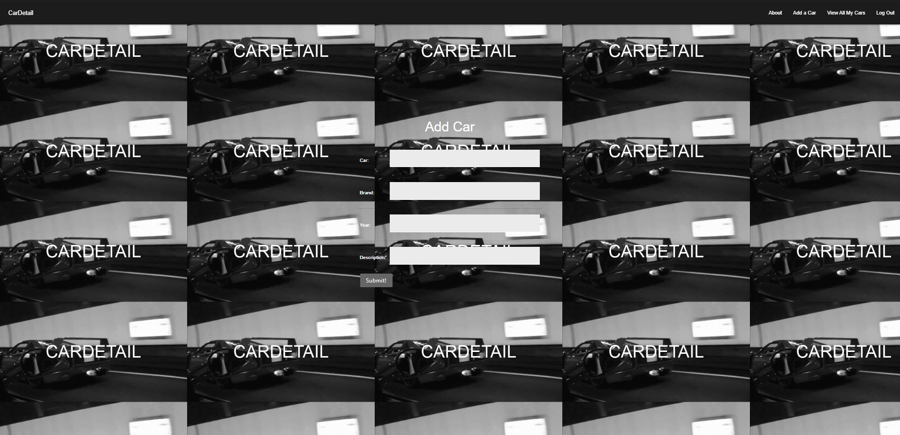

# CarDetail

#### 

## Description
This app serves the purpose of introducing allowing car enthuiast a way to keep track of all there favorite cars or 
specific informations regarding cars.

## Technologies Used
* HTML5
* CSS3
* Django 
* PostreSQL

## Whiteboard Images
* All Sketches are on figma

## Project Next Steps
* Users will be able to see other users car details in a global stage
* More attractive design

## VIEW
* You can view the repository:
[Github.com](https://github.com/nicholasmolina2019/CarDetails)
* You can view this site:
[Heroku](https://cardetailx.herokuapp.com/)
    

